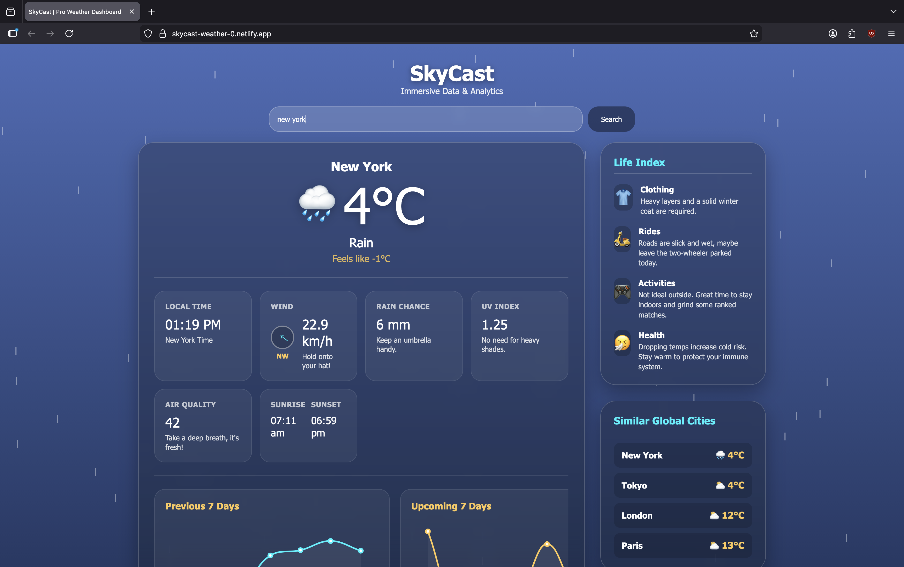
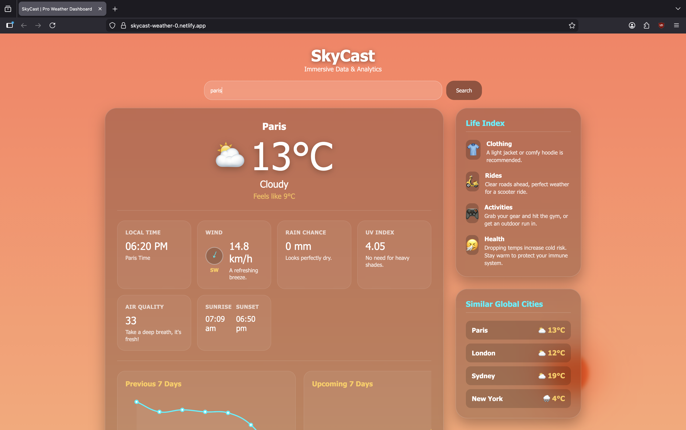
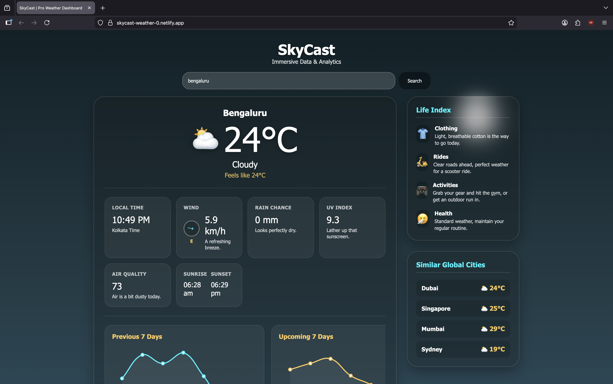

# 🌤️ SkyCast Pro - Advanced Weather Dashboard

SkyCast Pro is a high-performance, widescreen weather analytics dashboard built entirely with Vanilla JavaScript. It goes beyond basic weather apps by offering deep data visualization, real-time global comparisons, and a contextual "Life Index" engine.

## 📸 Interface Preview

## 🌗 Dynamic Environment Engine
SkyCast Pro automatically shifts its visual language based on the local time and weather of the target city.

<table style="width: 100%;">
  <tr>
    <td align="center" width="33%">
       
      <b>Morning</b>
    </td>
    <td align="center" width="33%">
       
      <b>Evening</b>
    </td>
    <td align="center" width="33%">
       
      <b>Night</b>
    </td>
  </tr>
</table>

## 🚀 Live Demo
[View the Live Dashboard Here] ( skycast-weather-0.netlify.app )

## ✨ Core Features
* **Dynamic Sky Engine:** The UI background and celestial bodies (Sun/Moon) physically react to the real-time weather codes and exact local time of the searched city.
* **Global City Matcher:** An asynchronous multi-fetch engine that scans major global hubs (London, Tokyo, Dubai, etc.) to instantly find cities experiencing similar temperatures.
* **15-Day Trend Analytics:** Interactive, scrollable Chart.js graphs mapping past and future weather trends with multi-line emoji labels and custom hover tooltips.
* **Smart Life Index:** A contextual algorithm combining temperature, rain probability, and air quality to generate actionable advice for clothing, riding, sports, and health.
* **Live World Clock:** Calculates and ticks in real-time based on the exact timezone of the queried coordinate.
* **Glassmorphism UI:** A premium, responsive dual-column layout with hover-glowing widgets and deep-links to specialized data sources.

## 🛠️ Tech Stack
* **Frontend:** HTML5, CSS3 (Flexbox/Grid, Glassmorphism), Vanilla JavaScript (ES6+).
* **Data Visualization:** Chart.js.
* **APIs Used:** Open-Meteo (Weather, Air Quality, Geocoding) - *100% free and open-source, no API keys required.*

## 🧠 Technical Highlights
* **Asynchronous JavaScript:** Heavy use of `async/await` and `Promise.all()` to simultaneously fetch geocoding, current weather, 15-day forecasts, and air quality without blocking the UI.
* **Robust Data Handling:** Custom `safeGet()` utility functions to prevent application crashes when dealing with deeply nested or missing JSON data.
* **Zero Dependencies:** Built entirely without frontend frameworks (React/Vue) to demonstrate a strong mastery of DOM manipulation and Vanilla JS architecture.

## 👨‍💻 Run Locally
1. Clone the repository: `git clone https://github.com/Sukeertjoshi-8/skycast-weather-dashboard.git`
2. Open the folder in your code editor.
3. Run `index.html` via Live Server. No build steps or package managers required.
